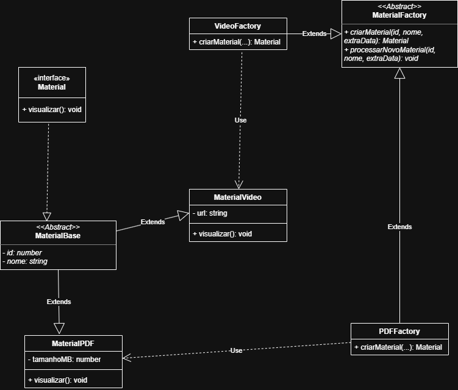

# 3.1.1. Factory Method — Aplicado ao OrganizeSeuGrupo

## 1. Introdução

O **Factory Method** é um padrão de projeto **criacional** descrito pela Gang of Four (GoF). Seu objetivo é definir uma interface para criar um objeto, mas **deixar que as subclasses decidam qual classe concreta instanciar**. Em outras palavras, ele *adia* a instanciação para subclasses especializadas, permitindo que o código cliente trabalhe apenas com abstrações.

Esse padrão é especialmente útil quando:

* Existe uma **família de produtos** com um contrato comum, mas comportamentos distintos.
* O código cliente **não deve conhecer** as classes concretas que serão instanciadas.
* O sistema precisa estar **aberto à extensão** (novos tipos de produto) sem alterar o código existente — **OCP**.


## 2. Motivação no OrganizeSeuGrupo

No OrganizeSeuGrupo, um dos fluxos centrais é o **compartilhamento de materiais de estudo** dentro de um grupo. Esses materiais podem ter naturezas muito distintas — um PDF, um vídeo, e futuramente outros formatos como podcast, slide ou quiz. Cada tipo possui particularidades:

* Atributos específicos (ex.: `tamanhoMB` para PDFs, `url` para vídeos).
* Comportamento de visualização próprio (abrir um leitor de PDF, carregar um player de vídeo, etc.).

Por outro lado, **o fluxo de alto nível é sempre o mesmo**: receber os dados, persistir o material no banco e disparar a sua visualização. Esse cenário — "mesma orquestração, produtos diferentes" — é exatamente o problema que o Factory Method resolve.

Sem o padrão, o serviço de criação de materiais ficaria poluído com condicionais (`if (tipo === 'pdf') ... else if (tipo === 'video') ...`), violando OCP e SRP. Com o padrão, cada tipo novo é uma nova fábrica — o código existente permanece intocado.


## 3. Estrutura do Padrão (mapeamento ao projeto)

| Papel GoF | Classe no projeto | Responsabilidade |
| :-------- | :---------------- | :--------------- |
| **Product** | `Material` (interface) | Define o contrato público (`visualizar(): void`). |
| **AbstractProduct** | `MaterialBase` (classe abstrata) | Centraliza o estado comum (`id`, `nome`) e mantém `visualizar()` abstrato. |
| **ConcreteProduct** | `MaterialPDF`, `MaterialVideo` | Materiais concretos com seus atributos e implementação de `visualizar()`. |
| **Creator** | `MaterialFactory` (classe abstrata) | Declara o *factory method* `criarMaterial(...)` e fornece a operação concreta `processarNovoMaterial(...)`. |
| **ConcreteCreator** | `PDFFactory`, `VideoFactory` | Implementam o *factory method*, instanciando o `ConcreteProduct` correspondente. |

### Fluxo de execução

1. O cliente instancia a fábrica concreta (`new PDFFactory()` ou `new VideoFactory()`).
2. Chama `processarNovoMaterial(id, nome, extraData)` na fábrica.
3. Esse método invoca internamente o *factory method* `criarMaterial(...)`, que devolve um `Material` (referência polimórfica).
4. A fábrica simula a persistência (`[DB] Salvando...`) e chama `material.visualizar()`.
5. O polimorfismo resolve, em tempo de execução, qual `visualizar()` será executado — sem que o cliente conheça a classe concreta.


## 4. Modelagem (UML)

<p align="center"><b>Figura 1 -</b> Diagrama de classes do Factory Method aplicado ao OrganizeSeuGrupo.</p>



<p align="center"><b>Fonte:</b> <a href="https://github.com/LucasAlves71"> Lucas Alves</a> e <a href="https://github.com/Acciolyy"> Thiago Viriato</p>

**Pontos a observar no diagrama:**

* A relação tracejada entre `MaterialBase` e `Material` indica **realização de interface**.
* As setas cheias entre `MaterialPDF` / `MaterialVideo` e `MaterialBase` indicam **herança** (`extends`).
* As setas tracejadas com o rótulo *Use* entre `PDFFactory` → `MaterialPDF` e `VideoFactory` → `MaterialVideo` representam a **dependência** criada pelo factory method (a fábrica instancia o produto concreto).
* As setas vazadas entre `PDFFactory` / `VideoFactory` e `MaterialFactory` indicam **herança** das fábricas.


## 5. Implementação (TypeScript / Node.js)

O código-fonte oficial está em [`implementacao/factoryMethod.ts`](../../implementacao/factoryMethod.ts). Abaixo, cada participante do padrão é apresentado individualmente.

### 5.1. Product — interface `Material`

```typescript
// Product 
interface Material {
    visualizar(): void;
}
```

### 5.2. AbstractProduct — classe abstrata `MaterialBase`

```typescript
// AbstractProduct 
abstract class MaterialBase implements Material {
    private id: number;
    private nome: string;

    constructor(id: number, nome: string) {
        this.id = id;
        this.nome = nome;
    }

    protected getId(): number {
        return this.id;
    }

    protected getNome(): string {
        return this.nome;
    }

    public abstract visualizar(): void;
}
```

> **Por que separar `Material` (interface) de `MaterialBase` (classe abstrata)?**
> A interface define o **contrato externo** — é o ponto de acoplamento usado pelo restante do sistema (DIP). A classe abstrata isola o **estado comum** entre os produtos, evitando duplicação (SRP). Manter `visualizar()` abstrato em `MaterialBase` obriga cada produto concreto a implementar seu próprio comportamento de visualização.

### 5.3. ConcreteProduct — `MaterialPDF`

```typescript
// ConcreteProduct 
class MaterialPDF extends MaterialBase {
    private tamanhoMB: number;

    constructor(id: number, nome: string, tamanhoMB: number) {
        super(id, nome);
        this.tamanhoMB = tamanhoMB;
    }

    public visualizar(): void {
        console.log(
            `[PDF] Abrindo visualizador para "${this.getNome()}" ` +
            `(id=${this.getId()}, ${this.tamanhoMB} MB)...`
        );
    }
}
```

### 5.4. ConcreteProduct — `MaterialVideo`

```typescript
// ConcreteProduct 
class MaterialVideo extends MaterialBase {
    private url: string;

    constructor(id: number, nome: string, url: string) {
        super(id, nome);
        this.url = url;
    }

    public visualizar(): void {
        console.log(
            `[VIDEO] Carregando player para "${this.getNome()}" ` +
            `(id=${this.getId()}) a partir de ${this.url}...`
        );
    }
}
```

### 5.5. Creator — classe abstrata `MaterialFactory`

```typescript
// Creator 
abstract class MaterialFactory {
    public abstract criarMaterial(
        id: number,
        nome: string,
        extraData: any
    ): Material;

    public processarNovoMaterial(
        id: number,
        nome: string,
        extraData: any
    ): void {
        const material = this.criarMaterial(id, nome, extraData);
        console.log(
            `[DB] Salvando material "${nome}" (id=${id}) no banco de dados...`
        );
        material.visualizar();
    }
}
```

### 5.6. ConcreteCreator — `PDFFactory`

```typescript
// ConcreteCreator 
class PDFFactory extends MaterialFactory {
    public criarMaterial(
        id: number,
        nome: string,
        extraData: { tamanhoMB: number }
    ): Material {
        return new MaterialPDF(id, nome, extraData.tamanhoMB);
    }
}
```

### 5.7. ConcreteCreator — `VideoFactory`

```typescript
// ConcreteCreator 
class VideoFactory extends MaterialFactory {
    public criarMaterial(
        id: number,
        nome: string,
        extraData: { url: string }
    ): Material {
        return new MaterialVideo(id, nome, extraData.url);
    }
}
```

### 5.8. Bloco de execução (Cliente)

```typescript
// Cliente 
const pdfFactory: MaterialFactory = new PDFFactory();
const videoFactory: MaterialFactory = new VideoFactory();

console.log('=== Processando novo material PDF ===');
pdfFactory.processarNovoMaterial(
    1,
    'Apostila de Arquitetura de Software',
    { tamanhoMB: 4.7 }
);

console.log('\n=== Processando novo material Vídeo ===');
videoFactory.processarNovoMaterial(
    2,
    'Aula sobre Padrões GoF Criacionais',
    { url: 'https://cdn.organizeseugrupo.com/videos/gof-criacionais.mp4' }
);
```

## 6. Saída Esperada

```
=== Processando novo material PDF ===
[DB] Salvando material "Apostila de Arquitetura de Software" (id=1) no banco de dados...
[PDF] Abrindo visualizador para "Apostila de Arquitetura de Software" (id=1, 4.7 MB)...

=== Processando novo material Vídeo ===
[DB] Salvando material "Aula sobre Padrões GoF Criacionais" (id=2) no banco de dados...
[VIDEO] Carregando player para "Aula sobre Padrões GoF Criacionais" (id=2) a partir de https://cdn.organizeseugrupo.com/videos/gof-criacionais.mp4...
```

A execução comprova que o **cliente** (bloco final do arquivo) interage exclusivamente com o tipo abstrato `MaterialFactory` e que o comportamento específico de cada material é resolvido em runtime via polimorfismo — exatamente o ganho prometido pelo Factory Method.


## 8. Senso Crítico

### 8.1. Benefícios obtidos no OrganizeSeuGrupo

* **Extensibilidade (OCP):** adicionar um `MaterialPodcast` exige apenas criar duas classes novas (`MaterialPodcast` e `PodcastFactory`). Nenhum código existente precisa ser alterado.
* **Baixo acoplamento (DIP):** o cliente depende apenas de `MaterialFactory` e `Material` — não conhece classes concretas.
* **Coesão (SRP):** a lógica de criação fica nas fábricas; a lógica de visualização fica nos produtos. Cada classe tem uma única razão para mudar.
* **Reuso de orquestração:** `processarNovoMaterial` é definido **uma única vez** no `Creator` e reaproveitado por todas as fábricas concretas.

### 8.2. Custos e ressalvas

* **Mais classes:** o padrão multiplica o número de classes. Em sistemas pequenos ou com poucos tipos de produto, pode ser exagero.
* **Indireção:** desenvolvedores que leem o código pela primeira vez precisam entender o fluxo polimórfico — há um overhead cognitivo.
* **`extraData: any`:** optamos por um parâmetro genérico no *factory method* para permitir variações entre tipos. Em produção, valeria refinar com *type guards* ou *generics* para reforçar a tipagem (`MaterialFactory<TExtra>`).


## 9. Referências

* GAMMA, Erich; HELM, Richard; JOHNSON, Ralph; VLISSIDES, John. **Design Patterns: Elements of Reusable Object-Oriented Software**. Addison-Wesley, 1994.
* SERRANO, Milene. **Aula - GOFs Criacionais**. Material de Aula. Arquitetura e Desenho de Software, UnB/FCTE, 2026.
* SERRANO, Milene. **Aula - Princípios SOLID**. Material de Aula. Arquitetura e Desenho de Software, UnB/FCTE, 2026.
* REFACTORING.GURU. **Factory Method**. Disponível em: <https://refactoring.guru/design-patterns/factory-method>. Acesso em: 12 maio 2026.


## 10. Histórico de Versões

| Versão | Data       | Descrição                                                                       | Autor                                                                                                  | Revisor                                              |
| :----: | ---------- | ------------------------------------------------------------------------------- | ------------------------------------------------------------------------------------------------------ | ---------------------------------------------------- |
| `1.0`  | 12/05/2026 | Criação do documento dedicado ao Factory Method (teoria, modelagem, código).   | [Lucas Alves](https://github.com/LucasAlves71) e [Thiago Viriato Accioly](https://github.com/Acciolyy) | [Eduardo de Pina](https://github.com/eduardodpms)    |
