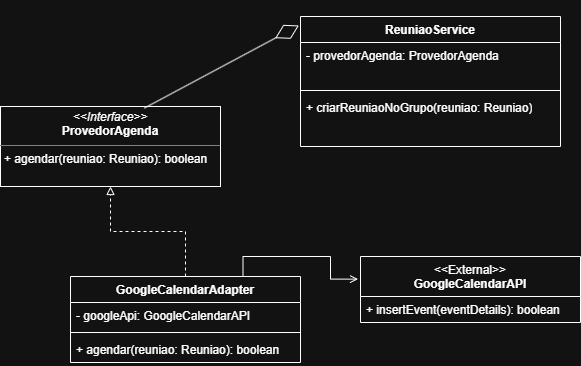

# 3.2.1. Adapter — Aplicado ao OrganizeSeuGrupo

## Introdução

O padrão **Adapter** (também conhecido como **Adaptador** ou **Wrapper**) é um dos padrões estruturais do catálogo GoF, cujo propósito é **permitir que objetos com interfaces incompatíveis colaborem entre si**.

O Adapter cria uma classe intermediária que atua como um **tradutor** entre o código cliente e uma classe de serviço existente que possui uma "interface estranha" — geralmente uma API de terceiros, código legado ou um SDK externo que não pode (ou não deve) ser modificado.

> Segundo o Refactoring.Guru:
>
> "O Adapter é um objeto especial que converte a interface de um objeto para que outro objeto possa entendê-lo", facilitando a colaboração entre objetos com interfaces diferentes. O adaptador encobre um dos objetos para esconder a complexidade da conversão que acontece nos bastidores.
>
> Fonte: [Refactoring.Guru](https://refactoring.guru/pt-br/design-patterns/adapter)

O Adapter é especialmente útil quando se precisa usar uma classe útil — geralmente de terceiros ou código legado — que não pode ser alterada, mas que possui uma interface incompatível com o resto do código.

Seus principais benefícios são:

- **Permitir a Reutilização:** o cliente passa a utilizar uma classe de serviço existente que, de outra forma, seria inutilizável devido à incompatibilidade de interface.
- **Aderência a Princípios:** separa a lógica de conversão de interface/dados da lógica primária de negócio (Princípio da Responsabilidade Única).
- **Flexibilidade (Princípio Aberto/Fechado):** novos adaptadores podem ser introduzidos sem quebrar o código cliente, desde que ele dependa apenas da interface Target.
- **Tradução de Dados:** pode converter dados entre formatos (ex.: campos de domínio para o JSON esperado por uma API externa) ou unidades.


## Rastreabilidade

O padrão Adapter está relacionado aos artefatos de Modelagem Estática do projeto, conforme a tabela abaixo:

| Artefato UML | Padrão | Função no Projeto / Rastreabilidade |
| :----------- | :----- | :---------------------------------- |
| **Diagrama de Classes** | Adapter | O Adapter é aplicado na **integração da agenda de reuniões** com provedores externos. A interface `ProvedorAgenda` é o **Target** que o restante do domínio enxerga; `GoogleCalendarAdapter` é o **Adapter** que traduz chamadas do domínio (`Reuniao`) para o formato esperado pela API externa (`GoogleCalendarAPI`), permitindo que o `ReuniaoService` agende reuniões sem conhecer detalhes do Google Calendar. |

<p align="center"><b>Tabela 1 -</b> Rastreabilidade do padrão Adapter no OrganizeSeuGrupo.</p>


## Modelagem

<p align="center"><b>Figura 1 -</b> Diagrama de classes do Adapter aplicado ao OrganizeSeuGrupo.</p>



<p align="center"><b>Fonte:</b> <a href="https://github.com/LucasAlves71"> Lucas Alves</a> e <a href="https://github.com/Acciolyy"> Thiago Viriato</a></p>

**Pontos a observar no diagrama:**

- A **interface `ProvedorAgenda`** é o **Target** — o contrato que o cliente conhece.
- A classe **`GoogleCalendarAPI`** (marcada com o estereótipo `<<External>>`) representa o **Adaptee** — sistema externo cuja interface não pode ser modificada.
- A classe **`GoogleCalendarAdapter`** é o **Adapter**: implementa o Target e mantém uma referência ao Adaptee (associação dirigida).
- A classe **`ReuniaoService`** é o **Cliente**, acoplado apenas à abstração `ProvedorAgenda` (Agregação + Injeção de Dependência).


## Código

A implementação foi feita em **TypeScript** (Node.js), stack adotada para o backend do OrganizeSeuGrupo. O arquivo-fonte está em [`implementacao/adapter.ts`](../../implementacao/adapter.ts).

### Entidade de domínio (Reuniao)

```typescript
class Reuniao {
    public titulo: string;
    public dataInicio: Date;
    public dataFim: Date;

    constructor(titulo: string, dataInicio: Date, dataFim: Date) {
        this.titulo = titulo;
        this.dataInicio = dataInicio;
        this.dataFim = dataFim;
    }
}
```

### Interface alvo (Target)

```typescript
// Target
interface ProvedorAgenda {
    agendar(reuniao: Reuniao): boolean;
}
```

### Sistema externo (Adaptee)

```typescript
// <<External>>
class GoogleCalendarAPI {
    public insertEvent(eventDetails: any): boolean {
        console.log(
            '[GoogleCalendarAPI] POST /calendar/v3/events ->',
            JSON.stringify(eventDetails)
        );
        return true;
    }
}
```

### Adapter

```typescript
class GoogleCalendarAdapter implements ProvedorAgenda {
    private googleApi: GoogleCalendarAPI;

    constructor() {
        this.googleApi = new GoogleCalendarAPI();
    }

    public agendar(reuniao: Reuniao): boolean {
        const eventDetails = {
            summary: reuniao.titulo,
            start: { dateTime: reuniao.dataInicio.toISOString() },
            end: { dateTime: reuniao.dataFim.toISOString() },
        };

        return this.googleApi.insertEvent(eventDetails);
    }
}
```

### Cliente (Client)

```typescript
class ReuniaoService {
    private provedorAgenda: ProvedorAgenda;

    constructor(provedorAgenda: ProvedorAgenda) {
        this.provedorAgenda = provedorAgenda;
    }

    public criarReuniaoNoGrupo(reuniao: Reuniao): boolean {
        console.log(
            `[DB] Salvando reunião "${reuniao.titulo}" no banco de dados local...`
        );
        return this.provedorAgenda.agendar(reuniao);
    }
}
```

### Bloco de execução

```typescript
const adapter: ProvedorAgenda = new GoogleCalendarAdapter();
const reuniaoService = new ReuniaoService(adapter);

const reuniao = new Reuniao(
    'Sprint Planning — Organize Seu Grupo',
    new Date('2026-05-15T14:00:00.000Z'),
    new Date('2026-05-15T15:30:00.000Z')
);

console.log('=== Criando reunião no grupo ===');
const sucesso = reuniaoService.criarReuniaoNoGrupo(reuniao);
console.log(`Resultado do agendamento: ${sucesso ? 'OK' : 'FALHOU'}`);
```

<p align="center"><b>Fonte:</b> <a href="https://github.com/LucasAlves71"> Lucas Alves</a>e <a href="https://github.com/Acciolyy"> Thiago Viriato</a></p>


## Saída Esperada

```
=== Criando reunião no grupo ===
[DB] Salvando reunião "Sprint Planning — Organize Seu Grupo" no banco de dados local...
[GoogleCalendarAPI] POST /calendar/v3/events -> {"summary":"Sprint Planning — Organize Seu Grupo","start":{"dateTime":"2026-05-15T14:00:00.000Z"},"end":{"dateTime":"2026-05-15T15:30:00.000Z"}}
Resultado do agendamento: OK
```

A execução evidencia que o cliente (`ReuniaoService`) jamais chama diretamente `GoogleCalendarAPI`. Toda a tradução de dados (campos `titulo`, `dataInicio`, `dataFim` → `summary`, `start.dateTime`, `end.dateTime`) acontece dentro do `GoogleCalendarAdapter` — exatamente o ganho prometido pelo padrão.


## Conclusão

O Adapter é uma solução prática para integrar APIs incompatíveis sem a necessidade de modificar o código legado ou de terceiros. Ele favorece a **reutilização** e o **desacoplamento**, permitindo que o cliente trabalhe contra uma interface uniforme (Target) enquanto os Adaptees mantêm suas implementações próprias.

No OrganizeSeuGrupo, o `GoogleCalendarAdapter` mostra como encapsular um SDK externo por trás da interface `ProvedorAgenda`, simplificando o uso pelo cliente e protegendo o domínio (`ReuniaoService`) das particularidades da API do Google. Caso, no futuro, a equipe queira suportar Microsoft Outlook ou Apple Calendar, basta criar um novo Adapter (ex.: `OutlookCalendarAdapter`) — o `ReuniaoService` permanece **intocado**, atendendo ao **Princípio Aberto/Fechado**.

Contudo, vale a ressalva: a introdução de adaptadores adiciona uma camada de delegação. Mantenha-os simples, bem documentados e com responsabilidade única para evitar complexidade desnecessária.


## Referências

> **Refactoring.Guru** — Padrão Adapter: <https://refactoring.guru/pt-br/design-patterns/adapter>.

> **GAMMA, Erich; HELM, Richard; JOHNSON, Ralph; VLISSIDES, John.** *Design Patterns: Elements of Reusable Object-Oriented Software*. Addison-Wesley, 1994.

> **Slides da Prof.ª Milene Serrano** — Aula GoFs Estruturais. Arquitetura e Desenho de Software, UnB/FCTE, 2026.


## Histórico de Versões

| Versão | Data       | Descrição                                                                                        | Autor                                                                                                  | Revisor                                              |
| :----: | ---------- | ------------------------------------------------------------------------------------------------ | ------------------------------------------------------------------------------------------------------ | ---------------------------------------------------- |
| `1.0`  | 12/05/2026 | Criação do documento dedicado ao Adapter (introdução, rastreabilidade, modelagem, código, execução, conclusão). | [Lucas Alves](https://github.com/LucasAlves71) e [Thiago Viriato Accioly](https://github.com/Acciolyy) | [Eduardo de Pina](https://github.com/eduardodpms)    |
