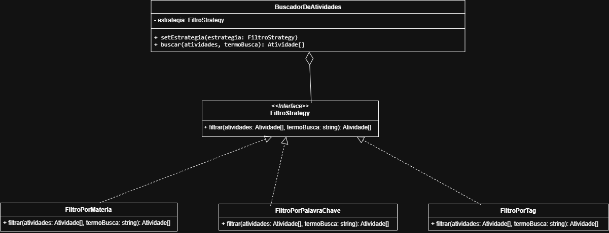

# 3.3.1. Strategy — Aplicado ao OrganizeSeuGrupo

## Introdução

O padrão **Strategy** (também conhecido como **Estratégia** ou **Policy**) é um dos padrões comportamentais do catálogo GoF, cujo propósito é **definir uma família de algoritmos, encapsular cada um deles em uma classe própria e torná-los intercambiáveis em tempo de execução**.

O Strategy permite que o algoritmo varie independentemente dos clientes que o utilizam: o contexto **delega** a execução a um objeto de estratégia em vez de implementar a lógica por meio de condicionais (`if/else` ou `switch`) sobre o "tipo" do algoritmo.

> Segundo o Refactoring.Guru:
>
> "Strategy é um padrão de projeto comportamental que permite que você defina uma família de algoritmos, coloque-os em classes separadas, e faça os objetos deles intercambiáveis."
>
> Fonte: [Refactoring.Guru](https://refactoring.guru/pt-br/design-patterns/strategy)

O Strategy é especialmente útil quando se tem **diferentes variações de um mesmo comportamento** (ex.: diferentes formas de ordenar, filtrar, calcular impostos, validar dados) e o cliente deve poder escolher — ou trocar dinamicamente — qual variação será usada.

Seus principais benefícios são:

- **Princípio Aberto/Fechado (OCP):** novos algoritmos podem ser adicionados sem alterar o contexto que os utiliza.
- **Princípio da Responsabilidade Única (SRP):** cada algoritmo fica isolado em sua própria classe.
- **Eliminação de condicionais:** substitui blocos `if/else` ou `switch` que crescem indefinidamente conforme novos casos surgem.
- **Troca em tempo de execução:** o cliente pode escolher (ou alterar) a estratégia dinamicamente, sem recompilar.


## Rastreabilidade

O padrão Strategy está relacionado aos artefatos de Modelagem Estática e Dinâmica do projeto, conforme a tabela abaixo:

| Artefato UML | Padrão | Função no Projeto / Rastreabilidade |
| :----------- | :----- | :---------------------------------- |
| **Diagrama de Classes** | Strategy | O Strategy é aplicado na **busca de atividades** dentro de um grupo. A interface `FiltroStrategy` é o contrato comum aos algoritmos de filtro; `FiltroPorMateria`, `FiltroPorPalavraChave` e `FiltroPorTag` são as estratégias concretas; `BuscadorDeAtividades` é o **Contexto** que delega a filtragem para a estratégia injetada — permitindo trocar o critério de busca em tempo de execução. |

<p align="center"><b>Tabela 1 -</b> Rastreabilidade do padrão Strategy no OrganizeSeuGrupo.</p>


## Modelagem

<p align="center"><b>Figura 1 -</b> Diagrama de classes do Strategy aplicado ao OrganizeSeuGrupo.</p>



<p align="center"><b>Fonte:</b> <a href="https://github.com/LucasAlves71"> Lucas Alves</a> e <a href="https://github.com/Acciolyy"> Thiago Viriato</a></p>

**Pontos a observar no diagrama:**

- A classe **`BuscadorDeAtividades`** é o **Contexto**, que possui uma relação de **Agregação** (losango) com a interface `FiltroStrategy` — recebendo a estratégia "de fora" via construtor.
- A interface **`FiltroStrategy`** declara o método `filtrar(atividades, termoBusca): Atividade[]`, contrato comum a todos os algoritmos.
- As três classes concretas (**`FiltroPorMateria`**, **`FiltroPorPalavraChave`**, **`FiltroPorTag`**) realizam a interface (setas tracejadas com triângulo vazado) e implementam cada uma um critério de filtragem distinto.
- O Contexto não conhece as estratégias concretas — depende apenas da abstração `FiltroStrategy`, atendendo ao **Princípio da Inversão de Dependência (DIP)**.


## Código

A implementação foi feita em **TypeScript** (Node.js), stack adotada para o backend do OrganizeSeuGrupo. O arquivo-fonte está em [`implementacao/strategy.ts`](../../implementacao/strategy.ts).

### Entidade de domínio (Atividade)

```typescript
class Atividade {
    public id: number;
    public titulo: string;
    public materia: string;
    public tags: string[];

    constructor(id: number, titulo: string, materia: string, tags: string[]) {
        this.id = id;
        this.titulo = titulo;
        this.materia = materia;
        this.tags = tags;
    }
}
```

### Interface da Estratégia (Strategy)

```typescript
// Strategy
interface FiltroStrategy {
    filtrar(atividades: Atividade[], termoBusca: string): Atividade[];
}
```

### Estratégias Concretas (ConcreteStrategy)

```typescript
class FiltroPorMateria implements FiltroStrategy {
    public filtrar(atividades: Atividade[], termoBusca: string): Atividade[] {
        const termo = termoBusca.toLowerCase();
        return atividades.filter(
            (a) => a.materia.toLowerCase() === termo
        );
    }
}

class FiltroPorPalavraChave implements FiltroStrategy {
    public filtrar(atividades: Atividade[], termoBusca: string): Atividade[] {
        const termo = termoBusca.toLowerCase();
        return atividades.filter(
            (a) => a.titulo.toLowerCase().includes(termo)
        );
    }
}

class FiltroPorTag implements FiltroStrategy {
    public filtrar(atividades: Atividade[], termoBusca: string): Atividade[] {
        const termo = termoBusca.toLowerCase();
        return atividades.filter((a) =>
            a.tags.some((tag) => tag.toLowerCase() === termo)
        );
    }
}
```

### Contexto (Context)

```typescript
class BuscadorDeAtividades {
    private estrategia: FiltroStrategy;

    constructor(estrategia: FiltroStrategy) {
        this.estrategia = estrategia;
    }

    public setEstrategia(estrategia: FiltroStrategy): void {
        this.estrategia = estrategia;
    }

    public buscar(atividades: Atividade[], termoBusca: string): Atividade[] {
        return this.estrategia.filtrar(atividades, termoBusca);
    }
}
```

### Bloco de execução

```typescript
const atividades: Atividade[] = [
    new Atividade(1, 'Trabalho de Arquitetura — Diagrama UML', 'Arquitetura', ['uml', 'grupo']),
    new Atividade(2, 'Prova de Cálculo III',                    'Cálculo',     ['prova', 'individual']),
    new Atividade(3, 'Lista de Exercícios de Arquitetura',      'Arquitetura', ['lista', 'individual']),
    new Atividade(4, 'Apresentação em grupo de Banco de Dados', 'Banco',       ['apresentacao', 'grupo']),
];

const formatar = (lista: Atividade[]): string =>
    lista.map((a) => `#${a.id} ${a.titulo}`).join(' | ') || '(nenhuma)';

const buscador = new BuscadorDeAtividades(new FiltroPorMateria());

console.log('=== Estratégia: FiltroPorMateria | termo="Arquitetura" ===');
console.log(formatar(buscador.buscar(atividades, 'Arquitetura')));

buscador.setEstrategia(new FiltroPorPalavraChave());
console.log('\n=== Estratégia: FiltroPorPalavraChave | termo="prova" ===');
console.log(formatar(buscador.buscar(atividades, 'prova')));

buscador.setEstrategia(new FiltroPorTag());
console.log('\n=== Estratégia: FiltroPorTag | termo="grupo" ===');
console.log(formatar(buscador.buscar(atividades, 'grupo')));
```

<p align="center"><b>Fonte:</b> <a href="https://github.com/LucasAlves71"> Lucas Alves</a>e <a href="https://github.com/Acciolyy"> Thiago Viriato</a></p>


## Saída Esperada

```
=== Estratégia: FiltroPorMateria | termo="Arquitetura" ===
#1 Trabalho de Arquitetura — Diagrama UML | #3 Lista de Exercícios de Arquitetura

=== Estratégia: FiltroPorPalavraChave | termo="prova" ===
#2 Prova de Cálculo III

=== Estratégia: FiltroPorTag | termo="grupo" ===
#1 Trabalho de Arquitetura — Diagrama UML | #4 Apresentação em grupo de Banco de Dados
```

A execução evidencia o coração do padrão: **um mesmo objeto `buscador` exibe três comportamentos diferentes**, conforme a estratégia injetada via `setEstrategia(...)`. O contexto (`BuscadorDeAtividades`) **não foi alterado** entre as três chamadas — apenas a estratégia mudou em tempo de execução. Para introduzir um novo critério (ex.: `FiltroPorPrazo`, `FiltroPorDisciplinaFavorita`), basta criar uma nova classe que implemente `FiltroStrategy` — o `BuscadorDeAtividades` permanece **intocado**, atendendo ao Princípio Aberto/Fechado.


## Conclusão

O Strategy é uma solução elegante para o problema de **múltiplas variações de um mesmo comportamento**. Ele substitui o crescimento descontrolado de blocos `if/else` ou `switch` pelo uso de **polimorfismo + composição**, deixando o sistema mais coeso, testável e aberto à extensão.

No OrganizeSeuGrupo, o `BuscadorDeAtividades` mostra como permitir que o usuário escolha — e troque dinamicamente — o critério de busca dentro de um grupo, sem que o serviço de busca precise conhecer os detalhes de cada filtro. Caso, no futuro, a equipe queira oferecer novos modos de filtragem (por prazo, por nível de dificuldade, por status de conclusão), basta criar novas estratégias concretas — o contexto e o cliente permanecem **intocados**.

Como ressalva: o padrão multiplica o número de classes do sistema. Em casos com poucas variações estáveis, um simples `enum` + função pode ser suficiente. Use Strategy quando houver evidência de que as variações **vão crescer** ou **precisam ser trocadas dinamicamente**.


## Referências

> **Refactoring.Guru** — Padrão Strategy: <https://refactoring.guru/pt-br/design-patterns/strategy>.

> **GAMMA, Erich; HELM, Richard; JOHNSON, Ralph; VLISSIDES, John.** *Design Patterns: Elements of Reusable Object-Oriented Software*. Addison-Wesley, 1994.

> **Slides da Prof.ª Milene Serrano** — Aula GoFs Comportamentais. Arquitetura e Desenho de Software, UnB/FCTE, 2026.


## Histórico de Versões

| Versão | Data       | Descrição                                                                                          | Autor                                                                                                  | Revisor                                              |
| :----: | ---------- | -------------------------------------------------------------------------------------------------- | ------------------------------------------------------------------------------------------------------ | ---------------------------------------------------- |
| `1.0`  | 12/05/2026 | Criação do documento dedicado ao Strategy (introdução, rastreabilidade, modelagem, código, saída esperada, conclusão). | [Lucas Alves](https://github.com/LucasAlves71) e [Thiago Viriato Accioly](https://github.com/Acciolyy) | [Eduardo de Pina](https://github.com/eduardodpms)    |
